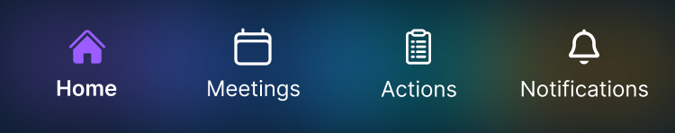

# ⚠️ Tab — Needs Visual Review

**Match score:** 85/100  
**Method:** vision  
**Generated by:** Guing AI (pixel-perfect loop)

## What this means
This component was generated by the AI but could not reach the pixel-perfect threshold
after the visual regeneration loop. It needs manual visual refinement.

## Visual differences reported

- Background color in code is set to a solid color '#091C2A', but the Figma design shows a gradient background.
- Icon color in the code is set to 'white', but the Figma design shows a purple icon for the 'Home' tab.

## Figma reference

The exact Figma node structure is saved in `Tab.figma.json`.

## How to fix locally
1. Open this component in your consuming app (or run Storybook locally).
2. Compare the rendered output against the Figma reference image above.
3. Edit `Tab.tsx` to address each difference listed above.
4. Use `Tab.figma.json` for exact geometry/token values.
5. When the component looks correct, delete this file and `Tab.figma.json`.
6. Remove `pixelReview: true` from `ai-manifest.json` for this component.
