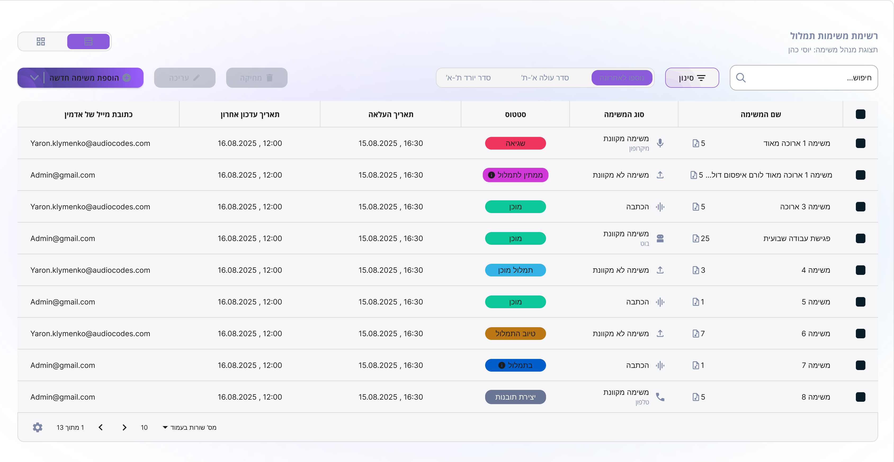

# ⚠️ Tasks — Needs Visual Review

**Match score:** 94/100  
**Method:** vision  
**Generated by:** Guing AI (pixel-perfect loop)

## Visual differences reported

- Border radius in the code is 12px, which matches the Figma manifest value, but visually it appears as 24px in the image due to 2x export. This is correct as per the manifest.
- The background color in the code is set to '#FFFFFF', which matches the expected value in the Figma manifest.

## Figma reference

The exact Figma node structure is saved in `Tasks.figma.json`.
